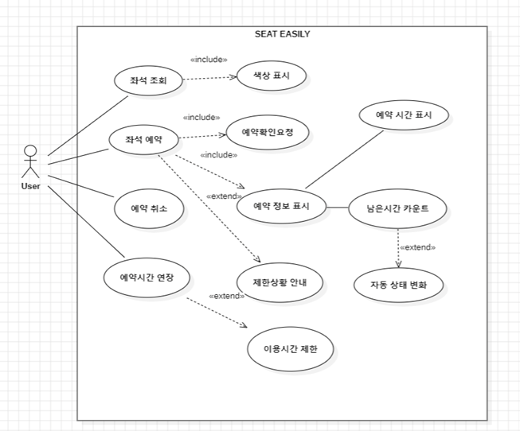
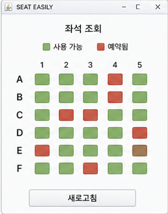
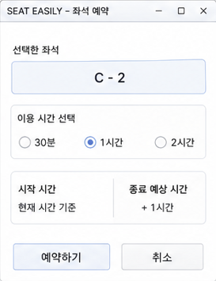
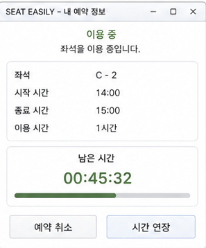
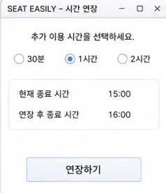
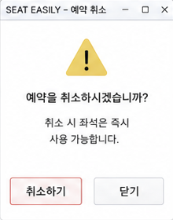
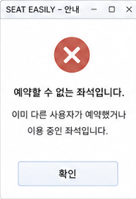
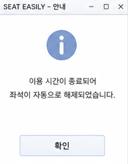

Seat Easily

\[ Revision history \]

| **Revision date** | **Version \#** | **Description** | **Author** |
|-------------------|----------------|-----------------|------------|
|                   |                |                 |            |
|                   |                |                 |            |
|                   |                |                 |            |
|                   |                |                 |            |
|                   |                |                 |            |
|                   |                |                 |            |

= Contents =

1.  Introduction \...\...\...\...\...\...\...\...\...\...\...\...\...\...\...\...\...\...\...\...\...\...\...\...\...\...\...\...\...\....

2\. Use case analysis \...\...\...\...\...\...\...\...\...\...\...\...\...\...\...\...\...\...\...\...\...\...\...\...\...\...\...\...

3\. Domain analysis \...\...\...\...\...\...\...\...\...\...\...\...\...\...\...\...\...\...\...\...\...\...\...\...\...\...\...\...\.....

4\. User Interface prototype \...\...\...\...\...\...\...\...\...\...\...\...\...\...\...\...\...\...\...\...\...\...\...\...\....

5\. Glossary \...\...\...\...\...\...\...\...\...\...\...\...\...\...\...\...\...\...\...\...\...\...\...\...\...\...\...\...\...\...\...\...\...\...

6\. References \...\...\...\...\...\...\...\...\...\...\...\...\...\...\...\...\...\...\...\...\...\...\...\...\...\...\...\...\...\...\...\....

1.  Introduction

    1.  summary

최근 여러 대학 여러 공공기관에서 도서관, 열람실 등을 오픈하는 경우가 많아졌다. 자리예약 서비스가 없으면 도서관에 일명 알박기 등등 여러 사용자가 피해를 보는 경우가 생길수 있다.

이러한 피해를 줄이기 위해 만든 시스템이 SEAT Easily이다.

2.  Features of "SEAT EASILY"

이 앱에서는 이용자들이 좌석을 이용하기 위해서 예약을 할 수 있다. 그리고 예약시간이 지나면 취소되고 예약할 때 어느 위치에 앉으면 좋을지 고민하며 앉을 곳을 정할 수 있다.

3.  Goals

이 문서를 만드는 이유는 계획 단계에서 만든 기능들을 직접 구현 툴로 그려보고 기능들을 구체적으로 분석하여 구현할 때 좀더 편리하게 하기 위함이다.

2\. Use case analysis

계획 단계에서 작성한 use case list를 이용하여 starUML을 사용하여 유스케이스들을 그려보고 엑터와 유스케이스들의 관계를 명확히 하였다.

| USE CASE \#1 :좌석조회  |                                           |
|-------------------------|-------------------------------------------|
| GENERAL CHARACTERISTICS |                                           |
| Summary                 | 사용자가 전체 좌석의 상태를 확인하는 기능 |
| Scope                   | Seat Easily                               |
| Level                   | User level                                |
| Auther                  |                                           |
| Last Update             | 2026-5-5                                  |
| Status                  | Analysis                                  |
| Primary Actor           | User                                      |
| Preconditions           | 시스템이 실행중이다                       |
| Trigger                 | 사용자가 프로그램을 실행한다              |
| Success post condition  | 좌석 상태가 화면에 표시                   |
| Failed Post Condition   | 좌석 정보를 불러오지 못함                 |
| Main Success Scenario   |                                           |
| Step                    | Action                                    |
| 1                       | 시스템이 좌석 정보를 로드                 |
| 2                       | 시스템이 좌석 상태를 색상으로 표시        |
| 3                       | 사용자가 좌석 상태를 확인                 |
| Extension Scenarios     |                                           |
| Step                    | Branching Action                          |
| 1 a                     | 좌석정보 로드 실패                        |
|                         |                                           |
| Related Information     |                                           |
| Performance             | \<=4ms                                    |
| Frequency               | 3번                                       |

| USE CASE \#2 : 좌석예약 |                                       |
|-------------------------|---------------------------------------|
| GENERAL CHARACTERISTICS |                                       |
| Summary                 | 사용자가 좌석을 선택하여 예약한다     |
| Scope                   | Seat Easily                           |
| Level                   | User level                            |
| Auther                  |                                       |
| Last Update             | 2026-5-5                              |
| Status                  | Analysis                              |
| Primary Actor           | User                                  |
| Preconditions           | 좌석이 선택되어 있고 예약 가능한 상태 |
| Trigger                 | 사용자가 예약 버튼을 클릭             |
| Success post condition  | 좌석이 예약되고 시간이 시작됨         |
| Failed Post Condition   | 이미 예약된 좌석                      |
| Main Success Scenario   |                                       |
| Step                    | Action                                |
| 1                       | 사용자가 좌석을 선택한다              |
| 2                       | 사용자가 예약 버튼을 누른다           |
| 3                       | 시스템이 예약 가능 여부 확인          |
| 4                       | 좌석을 예약 상태로 변경               |
| 5                       | 타이머 시작                           |
| 6                       | 예약 정보 표시                        |
| Extension Scenarios     |                                       |
| Step                    | Branch Action                         |
| 3a                      | 이미 예약된 좌석-\>실패 메시지        |
| 5a                      | 시간 종료-\>자동 해제                 |
| Related Information     |                                       |
| Performance             | \<=3ms                                |
| Frequency               | 10                                    |

| USE CASE \#3 : 예약 취소 |                                 |
|--------------------------|---------------------------------|
| GENERAL CHARACTERISTICS  |                                 |
| Summary                  | 사용자가 예약된 좌석을 취소한다 |
| Scope                    | Seat Easily                     |
| Level                    | User-level                      |
| Auther                   |                                 |
| Last Update              | 2026-5-5                        |
| Status                   | Analysis                        |
| Primary Actor            | User                            |
| Preconditions            | 좌석이 예약된 상태              |
| Trigger                  | 사용자가 취소 버튼 클릭         |
| Success post condition   | 좌석이 사용 가능 상태로 변경    |
| Failed Post Condition    | 취소할 예약 없음                |
| Main Success Scenario    |                                 |
| Step                     | Action                          |
| 1                        | 사용자가 취소 버튼 클릭         |
| 2                        | 시스템이 예약 상태 확인         |
| 3                        | 좌석 상태를 사용 가능으로 변경  |
| 4                        | 타이머 종료                     |
| Extension Scenarios      |                                 |
| Step                     | Branch Action                   |
| 2a                       | 예약 없음 → 오류 메시지         |
| Related Information      |                                 |
| Performance              | \<=3ms                          |
| Frequency                | 5                               |

| USE CASE \#4: 시간연장  |                               |
|-------------------------|-------------------------------|
| GENERAL CHARACTERISTICS |                               |
| Summary                 | 사용자가 예약 시간을 연장한다 |
| Scope                   | Seat Easily                   |
| Level                   | User-level                    |
| Auther                  |                               |
| Last Update             | 2026-5-5                      |
| Status                  | Analysis                      |
| Primary Actor           | User                          |
| Preconditions           | 예약이 진행중                 |
| Trigger                 | 연장 버튼 클릭                |
| Success post condition  | 남은 시간이 증가              |
| Failed Post Condition   | 연장 불가                     |
| Main Success Scenario   |                               |
| Step                    | Action                        |
| 1                       | 사용자가 연장 버튼 클릭       |
| 2                       | 시스템이 현재 예약 확인       |
| 3                       | 남은 시간 증가                |
| 4                       | 업데이트 된 시간 표시         |
| Extension Scenarios     |                               |
| Step                    | Branch Action                 |
| 2a                      | 예약 없음-\>연장 실패         |
| Related Information     |                               |
| Performance             | \<=2ms                        |
| Frequency               | 2                             |

| USE CASE \#5: 좌석 색상 표시 |                                             |
|------------------------------|---------------------------------------------|
| GENERAL CHARACTERISTICS      |                                             |
| Summary                      | 시스템이 좌석 상태에 따라 색상으로 표시한다 |
| Scope                        | Seat Easily                                 |
| Level                        | System level                                |
| Auther                       |                                             |
| Last Update                  | 2026-5-5                                    |
| Status                       | Analysis                                    |
| Primary Actor                | System                                      |
| Preconditions                | 좌석 상태 정보가 존재함                     |
| Trigger                      | 좌석 상태가 변경되거나 조회 화면이 로드     |
| Success post condition       | 좌석 상태가 색상으로 정확히 표시            |
| Failed Post Condition        | 잘못된 상태 표시                            |
| Main Success Scenario        |                                             |
| Step                         | Action                                      |
| 1                            | 시스템이 좌석 상태를 확인                   |
| 2                            | 상태에 따라 색상 결정                       |
| 3                            | 좌석 UI에 색상 적용                         |
| Extension Scenarios          |                                             |
| Step                         | Branch Action                               |
| 1a                           | 좌석 상태 오류-\>기본 색상 표시             |
| Related Information          |                                             |
| Performance                  | \<=3ms                                      |
| Frequency                    | 10                                          |

| USE CASE \#6 : 예약 확인 요청 |                                             |
|-------------------------------|---------------------------------------------|
| GENERAL CHARACTERISTICS       |                                             |
| Summary                       | 시스템이 예약 전 사용자에게 확인을 요청한다 |
| Scope                         | Seat Easily                                 |
| Level                         | System level                                |
| Auther                        |                                             |
| Last Update                   | 2026-5-5                                    |
| Status                        | Analysis                                    |
| Primary Actor                 | System                                      |
| Preconditions                 | 사용자가 좌석을 선택함                      |
| Trigger                       | 예약 버튼 클릭                              |
| Success post condition        | 사용자가 예약을확정함                       |
| Failed Post Condition         | 사용자가 예약 취소                          |
| Main Success Scenario         |                                             |
| Step                          | Action                                      |
| 1                             | 시스템이 확인 메시지를 표시                 |
| 2                             | 사용자가 확인을 선택                        |
| 3                             | 예약 진행                                   |
| Extension Scenarios           |                                             |
| Step                          | Branch Action                               |
| 2a                            | 사용자가 취소선택-\>예약 중단               |
| Related Information           |                                             |
| Performance                   | \<=3ms                                      |
| Frequency                     | 3                                           |

| USE CASE \#7: 예약 정보 표시 |                                               |
|------------------------------|-----------------------------------------------|
| GENERAL CHARACTERISTICS      |                                               |
| Summary                      | 시스템이 예약된 좌석의 정보를 사용자에게 표시 |
| Scope                        | Seat Easily                                   |
| Level                        | System level                                  |
| Auther                       |                                               |
| Last Update                  | 2026-5-5                                      |
| Status                       | Analysis                                      |
| Primary Actor                | System                                        |
| Preconditions                | 예약이 존재함                                 |
| Trigger                      | 예약 완료 또는 조회                           |
| Success post condition       | 예약 정보가 화면에 표시됨                     |
| Failed Post Condition        | 정보 표시 실패                                |
| Main Success Scenario        |                                               |
| Step                         | Action                                        |
| 1                            | 시스템이 예약 정보를 조회                     |
| 2                            | 남은 시간등 정보 계산                         |
| 3                            | 사용자에게 표시                               |
| Extension Scenarios          |                                               |
| Step                         | Branch Action                                 |
| 1a                           | 예약 정보 없음-\>표시안함                     |
| Related Information          |                                               |
| Performance                  | \<=3ms                                        |
| Frequency                    | 8                                             |

| USE CASE \#8 : 제한 상황 안내 |                                          |
|-------------------------------|------------------------------------------|
| GENERAL CHARACTERISTICS       |                                          |
| Summary                       | 시스템이 예약불가 상황을 사용자에게 안내 |
| Scope                         | Seat Easily                              |
| Level                         | System level                             |
| Auther                        |                                          |
| Last Update                   | 2026-5-5                                 |
| Status                        | Analysis                                 |
| Primary Actor                 | System                                   |
| Preconditions                 | 좌석이 이미 예약됨                       |
| Trigger                       | 사용자가 예약 시도                       |
| Success post condition        | 사용자에게 안내 메시지 출력              |
| Failed Post Condition         | 안내 실패                                |
| Main Success Scenario         |                                          |
| Step                          | Action                                   |
| 1                             | 시스템이 좌석 상태 확인                  |
| 2                             | 예약 불가 판단                           |
| 3                             | 안내 메시지 출력                         |
| Extension Scenarios           |                                          |
| Step                          | Branch Action                            |
| 2a                            | 상태 오류 -\> 일반 오류 메시지 보냄      |
| Related Information           |                                          |
| Performance                   | \<=2ms                                   |
| Frequency                     | 2                                        |

| USE CASE \#9: 이용 시간 제한 |                                    |
|------------------------------|------------------------------------|
| GENERAL CHARACTERISTICS      |                                    |
| Summary                      | 시스템이 최대 이용 시간을 제한한다 |
| Scope                        | Seat Easily                        |
| Level                        | System level                       |
| Auther                       |                                    |
| Last Update                  | 2026-5-5                           |
| Status                       | Analysis                           |
| Primary Actor                | System                             |
| Preconditions                | 예약이 진행중                      |
| Trigger                      | 일정 시간 초과                     |
| Success post condition       | 이용이 제한됨                      |
| Failed Post Condition        | 제한 적용 실패                     |
| Main Success Scenario        |                                    |
| Step                         | Action                             |
| 1                            | 시스템이 사용시간을 확인           |
| 2                            | 제한 시간 도달 여부 판단           |
| 3                            | 추가 이용 제한                     |
| Extension Scenarios          |                                    |
| Step                         | Branch Action                      |
| 2a                           | 연장 가능-\>제한 적용 안함         |
| Related Information          |                                    |
| Performance                  | \<=1ms                             |
| Frequency                    | 지속적으로 확인                    |

| USE CASE \#10: 예약 시간 표시 |                                    |
|-------------------------------|------------------------------------|
| GENERAL CHARACTERISTICS       |                                    |
| Summary                       | 시스템이 현재 예약 시간을 표시한다 |
| Scope                         | Seat Easily                        |
| Level                         | System level                       |
| Auther                        |                                    |
| Last Update                   | 2026-5-5                           |
| Status                        | Analysis                           |
| Primary Actor                 | System                             |
| Preconditions                 | 예약 존재                          |
| Trigger                       | 예약 진행중                        |
| Success post condition        | 시간이 표시됨                      |
| Failed Post Condition         | 표시 실패                          |
| Main Success Scenario         |                                    |
| Step                          | Action                             |
| 1                             | 시스템이 현재 시간을 계산          |
| 2                             | 화면에 표시                        |
| Extension Scenarios           |                                    |
| Step                          | Branch Action                      |
| 1a                            | 예약 없음-\> 표시안함              |
| Related Information           |                                    |
| Performance                   | \<=1ms                             |
| Frequency                     | 지속적으로 확인해야함              |

| USE CASE \#11 :남은 시간 카운트 |                                            |
|---------------------------------|--------------------------------------------|
| GENERAL CHARACTERISTICS         |                                            |
| Summary                         | 시스템이 남은 시간을 지속적으로 감소시킨다 |
| Scope                           | Seat Easily                                |
| Level                           | System level                               |
| Auther                          |                                            |
| Last Update                     | 2026-5-5                                   |
| Status                          | Analysis                                   |
| Primary Actor                   | System                                     |
| Preconditions                   | 예약 진행중                                |
| Trigger                         | 타이머 시작                                |
| Success post condition          | 시간이 정상적으로 감소                     |
| Failed Post Condition           | 시간 오류                                  |
| Main Success Scenario           |                                            |
| Step                            | Action                                     |
| 1                               | 타이머 시작                                |
| 2                               | 일정 간격마다 시간 감소                    |
| 3                               | 화면 갱신                                  |
| Extension Scenarios             |                                            |
| Step                            | Branch Action                              |
| 2a                              | 시간이 0에 도달하면 Usecase 12이동         |
| Related Information             |                                            |
| Performance                     | \<=1ms                                     |
| Frequency                       | 지속적으로 확인                            |

| USE CASE \#12: 자동 상태 변화 |                                               |
|-------------------------------|-----------------------------------------------|
| GENERAL CHARACTERISTICS       |                                               |
| Summary                       | 시간이 종료되면 좌석 상태를 자동으로 변경한다 |
| Scope                         | Seat Easily                                   |
| Level                         | System level                                  |
| Auther                        |                                               |
| Last Update                   | 2026-5-5                                      |
| Status                        | Analysis                                      |
| Primary Actor                 | System                                        |
| Preconditions                 | 예약 진행중                                   |
| Trigger                       | 남은 시간이 0이 될떄                          |
| Success post condition        | 좌석이 사용 가능 상태로 변경                  |
| Failed Post Condition         | 상태 변경 실패                                |
| Main Success Scenario         |                                               |
| Step                          | Action                                        |
| 1                             | 시간 종료 감지                                |
| 2                             | 좌석 상태 변경                                |
| 3                             | UI업데이트                                    |
| Extension Scenarios           |                                               |
| Step                          | Branch Action                                 |
| 1a                            | 타이머 오류-\>상태 유지                       |
| Related Information           |                                               |
| Performance                   | 즉시                                          |
| Frequency                     | 시간 종료 시                                  |

3\. Domain analysis

1\) User

시스템을 사용하는 사용자로, 좌석 조회,예약,취서,연장등의 기능 수행

2)Seat

사용자가 예약하거나 사용할 수 있는 개별 좌석을 나타냄

3)Reservation

사용자와 좌석 간의 예약 정보를 관리하는 클래스

4.  Time

예약 시간 및 남은 시간을 관리하는 클래스

5.  Seat Manager

좌석 상태를 관리하는 클래스, 좌석 조회 및 상태 변경

6.  ReservationManager

예약과 관련된 모든 로직을 처리하는 클래스

7.  Timer

시간 흐름에 따라 남은 시간을 감소시키고 자동 상태 변화를 처리하는 클래스

8.  Alert

사용자에게 시스템 상태나 제한 상황을 알려줌

4\. User Interface prototype

이곳에서 그려진 화면은 자바 스윙을 이용하여 간단히 구현

좌석 조회 화면이다. 빨간색은 이용중 초록색은 빈 좌석이다.(프로토 타입이라 실제와 좌석이 다를 수 있음)

좌석 예약 화면이다. 좌석 조회에서 초록색 자리를 누르면 뜨는 화면으로 이용시간 및 종료 예상시간이 나온다.

예약 정보 화면이다. 내가 예약한 좌석의 정보를 보여주는 화면으로 시간 연장,취소가 가능하다

예약 연장 화면이다. 시간 연장 버튼을 누르면 나오는 화면으로 연장이 가능하다.

  
예약 취소 화면이다. 예약 취소 버튼을 누르면 뜨는 화면으로 취소가 가능하다.

좌석 조회 화면에서 예약된 좌석을 누르면 나타나는 화면이다.

예약시간이 종료시 뜨는 화면이다.

5\. Glossary

6\. References
