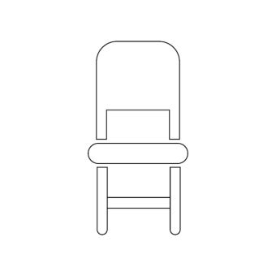
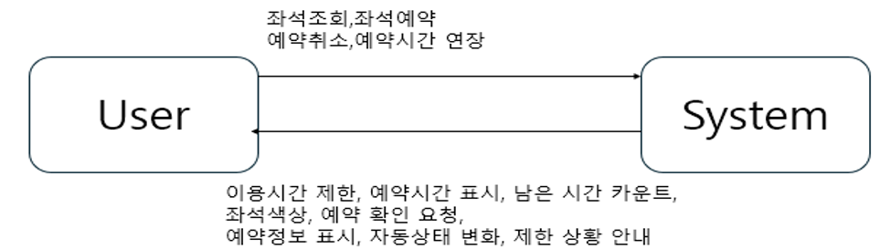

Seat Easily

- business purpose

최근 영남대학교에서 새로운 도서관을 신설하였다. 이곳에는 사람들이 쉴 수도 있고 함께 공부 할 수 있고 개인이 공부를 할 수 있는 공간도 마련되어 있다고 한다. 하지만 이곳에는 문제가 있는데 예약을 못하여 누가 어디 앉았는지 이전에 자리에 앉은 사람은 누구인지를 알 수 없다 그러하여 분실물을 되찾아주거나 어떠한 문제가 생겼을때 알 방법이 없는 일이 많고 한 사람이 계속 같은 자리를 차지하는 일도 허다하다고 한다. 이러한 이유로 대학교에서는 자리예약밎 사용앱을 만드려고하게되었고 이프로그램을 만들게 되었다. 이 프로그램으로 얻고자 하는 첫번째 목표는 더욱더 체계적인 자리사용과 효율적으로 자리를 예약하기위함이다. 두번째로는 이전 그리고 지금 사용자들의 정보를 기억해두고 분실물이나 문제가 생겼을때에 더욱더 쉽게 대응하기 위함도 있다. 세번째로 가끔 자리를 맡고 오지않는 학생이 있는데 이거에 대한 대처도 가능할것으로 보인다.네번째로는 자리를 예약하러 오는데에 번거로움도 해결해준다. 마지막으로 관리자의 입장에서는 좌석 사용현황을 쉽게 파악하게 해줄거 같다. 이 프로그램의 고객층은 도서관을 열 계획이 있거나 개장한지 얼마안된 도서관에 자리예약시스템으로 사용할 수 있어 고객층이 있을것이다.

- System context diagram

•좌석 조회: 현재 좌석들의 상태

•좌석 예약: 남은 좌석 중 예약

•예약 취소: 예약한 좌석 취소

•예약 시간 연장: 예약한 시간 연장

•이용시간 제한: 이용가능한 시간 제한

•예약시간 표시: 예약한 시간 표시

•남은 시간 카운트: 이용가능시간중 남은시간 표기

•좌석 색상: 이용중인 곳과 아닌곳 좌석 색상표시

•예약 확인 요청: 예약한 자리가 확실한지 확인요청

•예약 정보 표시: 예약한 자리번호와 시간 표기

•자동 상태 변화: 시간이 지나면 자동으로 좌석반환

•제한 상황 안내: 예약된 자리면 거절

3.Use case list

3.1 좌석 조회

| Actor       | User                                              |
| ----------- | ------------------------------------------------- |
| Description | 유저가 자리를 사용하기 위해 남은 자리를 조회한다. |

3.2 좌석 예약

| Actor       | User                         |
| ----------- | ---------------------------- |
| Description | 유저가 남은 자리를 예약한다. |

3.3 예약취소

| Actor       | User                       |
| ----------- | -------------------------- |
| Description | 유저가 자리예약을 취소한다 |

3.4 예약시간 연장

| Actor       | User                              |
| ----------- | --------------------------------- |
| Description | 유저가 예약한 시간을 더 연장한다. |

3.5 이용시간 제한

| Actor       | System                                                      |
| ----------- | ----------------------------------------------------------- |
| Description | 시스템이 이용시간을 제한하여 적절한 시간을 이용하도록 한다. |

3.6 예약시간 표시

| Actor       | System                            |
| ----------- | --------------------------------- |
| Description | 시스템이 예약한 시간을 표시해준다 |

3.7 남은 시간 카운트

| Actor       | System                                    |
| ----------- | ----------------------------------------- |
| Description | 시스템이 남은 시간을 카운트하여 보여준다. |

3.8 좌석 색상

| Actor       | System                                                         |
| ----------- | -------------------------------------------------------------- |
| Description | 시스템이 현재 자리의 상태에 따라 빨간색과 초록색으로 표시한다. |

3.9 예약 확인 요청

| Actor       | System                                           |
| ----------- | ------------------------------------------------ |
| Description | 시스템이 예약한 좌석이 확실한지 확인을 요청한다. |

3.10 예약 정보 표시

| Actor       | System                                         |
| ----------- | ---------------------------------------------- |
| Description | 시스템이 예약한 좌석의 남은시간등을 표시해준다 |

3.11 자동상태 변화

| Actor       | System                                                            |
| ----------- | ----------------------------------------------------------------- |
| Description | 시스템이 취소하지 않았지만 연장하지도 않은 좌석의 상태를 변경한다 |

3.12 제한 상황 안내

| Actor       | System                                               |
| ----------- | ---------------------------------------------------- |
| Description | 시스템이 이미 예약된 자리는 예약안된다고 안내해준다. |

4.Concept of operation

1)좌석 조회

| Purpose  | 사용자가 남은 좌석을 조회하고 싶을 때                                                                     |
| -------- | --------------------------------------------------------------------------------------------------------- |
| Approach | 사용자가 남은 좌석을 조회하고 싶을 때 시스템에서 배열로 되어있는 좌석의 정보를 가져와 사용자에게 보여준다 |
| Dynamics | 사용자가 조회버튼을 누를 경우                                                                             |
| Goals    | 좌석들의 상태를 보여준다                                                                                  |

2)좌석 예약

| Purpose  | 사용자가 남은 좌석중 앉고싶은 자리를 예약하려 할 때                                                    |
| -------- | ------------------------------------------------------------------------------------------------------ |
| Approach | 배열로 되어있는 좌석의 정보중 앉으려하는 자리의 번호를 가져와 예약으로 변경하고 관련된 정보를 보여준다 |
| Dynamics | 사용자가 예약버튼을 누를 경우                                                                          |
| Goals    | 사용자가 좌석을 예약한다.                                                                              |

3)예약 취소

| Purpose  | 사용자가 예약한 자리가 마음에 들지않아 예약을 취소할 때                                      |
| -------- | -------------------------------------------------------------------------------------------- |
| Approach | 배열로 되어있는 좌석의 정보중 예약한 번호를 확인하여 예약을 취소로 변경하고 관련된 정보 제공 |
| Dynamics | 사용자가 취소버튼을 누를 경우                                                                |
| Goals    | 사용자가 좌석 예약을 취소한다.                                                               |

4)예약시간 연장

| Purpose  | 사용자가 예약한시간보다 더욱더 사용하고 싶을 때                                     |
| -------- | ----------------------------------------------------------------------------------- |
| Approach | 배열로 되어있는 좌석의 정보주 예약한 번호의 정보중 예약시간과 관련된 val을 늘려준다 |
| Dynamics | 사용자가 연장 버튼을 누를 때                                                        |
| Goals    | 사용자의 예약시간을 늘려준다                                                        |

5)이용시간 제한

| Purpose  | 사용자가 예약가능한 시간보다 더욱더 사용하려 할 때                     |
| -------- | ---------------------------------------------------------------------- |
| Approach | 이용시간과 관련된 값보다 큰 경우에는 제한을 걸어 사용못하도록 막아준다 |
| Dynamics | 사용자가 예약가능한 시간보다 더욱더 사용하려 할 때                     |
| Goals    | 제한알림을 띄어준다                                                    |

6)예약시간 표시

| Purpose  | 사용자가 예약한 시간을 확인하려 할 때                 |
| -------- | ----------------------------------------------------- |
| Approach | 예약자가 예약한 자리의 번호에 저장된 val값을 리턴한다 |
| Dynamics | 사용자가 예약시간표시기능버튼을 누를 때               |
| Goals    | 예약시간을 표시해준다                                 |

7)남는 시간 카운트

| Purpose  | 사용자가 이용가능한 시간을 카운트하는 기능                                                            |
| -------- | ----------------------------------------------------------------------------------------------------- |
| Approach | 사용자가 예약한 자리의 사용가능한 시간을 카운트 해주는 값을 배열안 자리번호에 저장된 val값을 변경한다 |
| Dynamics | 시스템이 남은 시간을 카운트 하는 기능이 필요할 때                                                     |
| Goals    | 남은 시간을 카운트 한다                                                                               |

8)좌석 색상

| Purpose  | 시스템이 좌석들의 상태를 보여주기 위해                           |
| -------- | ---------------------------------------------------------------- |
| Approach | 배열안에 좌석중 예약된 좌석이면 빨간색으로 아니면초록색으로 표시 |
| Dynamics | 시스템이 좌석의 예약상태를 표현할 때                             |
| Goals    | 좌석의 색을 변경하여 주어 가시성을 높여준다                      |

9)예약 확인 요청

| Purpose  | 유저가 좌석을 예약할 때 한번더 확인하기 위해                                                 |
| -------- | -------------------------------------------------------------------------------------------- |
| Approach | 좌석을 예약 하려 할 때 확실한지 한번 더 물어보기 위해 예약 버튼을 누르면 확인문구를 띄어준다 |
| Dynamics | 유저가 좌석을 예약하려 할 때                                                                 |
| Goals    | 창을 띄어 한번더 확인 시켜준다                                                               |

10)예약 정보 표시

| Purpose  | 유저가 예약한 좌석의 정보를 알려할떄                                |
| -------- | ------------------------------------------------------------------- |
| Approach | 배열에 들어있는 좌석의 정보와 val(예약시간 ,남은시간 등)을 보여준다 |
| Dynamics | 유저가 예약정보 버튼을 눌렀을 때                                    |
| Goals    | 예약 정보를 표시하여준다                                            |

11)자동 상태 변화

| Purpose  | 만약 유저가 배정 취소를 하지 않거나 연장을 하지 않았을 때 자동으로 취소를 해주기 위해              |
| -------- | -------------------------------------------------------------------------------------------------- |
| Approach | 배열안에 저장된 예약시간이 지나거나 이용기간이 지났을 때 취소가 안되어있으면 자동으로 취소하여준다 |
| Dynamics | 시간이 지났음에도 취소가 안되면                                                                    |
| Goals    | 자동으로 취소시켜 준다                                                                             |

12)제한 상황 안내

| Purpose  | 만약 유저가 이미 예약된좌석 이용중인 좌석에 예약하려할 때  제한 메시지를 띄어주기 위해 |
| -------- | -------------------------------------------------------------------------------------------- |
| Approach | 배열안에 이미 예약중으로 뜨는데 만약 유저가 이곳에 예약하려고 하면 에러 메시지를 띄어줌      |
| Dynamics | 유저가 예약된 좌석에 예약하려 할 때                                                          |
| Goals    | 예약 에러 메시지를 띄어준다                                                                  |

5.Problem statement

이 프로그램은 유저와 프로그램 간의 현재 좌석 상태를 실시간으로 상호작용하는것이 중요하다. 이것을 위하여 실시간 데이터 처리와 좌석을 배열로 어떻게 처리할것인가에 대한 목적이 달성되어야 한다.

5.1 만약 여러 사용자가 한번에 같은 자리를 사용하려 하는 상황이 없다고는 할수 없다. 이러한 경우에는 동기화를 이용하여 해결해야한다.

5.2 많은 사용자가 있는 만큰 사용자들이 더욱더 보기 쉽게 하기위하여 가시성을 높여주는게 중요하다.

5.3 이러한 실시간 정보를 다루는 것에 대하여 아직 기술적으로 큰 어려움이 있다 .쓰레드 같은 것을 이용하면 실시간으로 정보를 상호작용하는것에 어려움이 없지만 이러한 기술을 다루어 본적은 거의 없기에 이러한 부분에 대해 개발자의 숙달을 필요로 할 것 같다.

5.4 이러한 정보를 배열에 담는다면 배열을 어느곳에 저장할지 그리고 배열안 자리의 번호에 대한 이용시간 예약시간 등의 정보는 어떤식으로 저장할 지에 대한 고민도 깊게 해 봐야 할 것 같다.

5.4.1이러한 정보를 담기 위하여 DB를 다룰 줄 알아야 하는데 이러한 기술에 대해서도 다루어 본적이 거의 없어 DB에 관한 정보도 조금은 공부해야 할 것 같다.

6.Glossary

| Terms    | Description                                                                              |
| -------- | ---------------------------------------------------------------------------------------- |
| User     | 이 앱을 사용하는 사용자이다. 이 사용자가 할수 있는 일은 위의 3,4 에 설명 되어 있다.      |
| System   | 이앱을 관리하는 프로그램이다. 이 프로그램은 사용자의 정보. 예약정보 이용정보를 담고있다. |
| 예약정보 | 사용자가 언제부터 사용하겠다를 포함한 정보이다                                           |
| 이용정보 | 사용자가 얼마나 사용했는지 언제까지 사용하는지를 포함하는 정보이다                       |

7.References
