> Seat Easily
>
> 

\[ Revision history \]

  -----------------------------------------------------------------------
  **Revision date** **Version   **Description**       **Author**
                    \#**                              
  ----------------- ----------- --------------------- -------------------
                                                      

                                                      

                                                      

                                                      

                                                      

                                                      
  -----------------------------------------------------------------------

= Contents =

1.  Introduction
    \...\...\...\...\...\...\...\...\...\...\...\...\...\...\...\...\...\...\...\...\...\...\...\...\...\...\...\...\...\...

2\. Class diagram
\...\...\...\...\...\...\...\...\...\...\...\...\...\...\...\...\...\...\...\...\...\...\...\...\...\...\...\...\....

3\. Sequence diagram
\...\...\...\...\...\...\...\...\...\...\...\...\...\...\...\...\...\...\...\...\...\...\...\...\...\...\....

4\. State machine diagram
\...\...\...\...\...\...\...\...\...\...\...\...\...\...\...\...\...\...\...\...\...\...\...\...\....

5\. Implementation requirements
\...\...\...\...\...\...\...\...\...\...\...\...\...\...\...\...\...\...\...\...\...\....

6\. Glossary
\...\...\...\...\...\...\...\...\...\...\...\...\...\...\...\...\...\...\...\...\...\...\...\...\...\...\...\...\...\...\...\...\....

7\. References
\...\...\...\...\...\...\...\...\...\...\...\...\...\...\...\...\...\...\...\...\...\...\...\...\...\...\...\...\...\...\...\....

1.  Introduction

1)  summary

최근 영남대학교에서 새로운 도서관을 신설하였다. 이곳에는 사람들이 쉴
수도 있고 함께 공부 할 수 있고 개인이 공부를 할 수 있는 공간도 마련되어
있다고 한다. 하지만 이곳에는 문제가 있는데 예약을 못하여 누가 어디
앉았는지 이전에 자리에 앉은 사람은 누구인지를 알 수 없다 그러하여
분실물을 되찾아주거나 어떠한 문제가 생겼을때 알 방법이 없는 일이 많고 한
사람이 계속 같은 자리를 차지하는 일도 허다하다고 한다. 이러한 이유로
대학교에서는 자리예약밎 사용앱을 만드려고하게되었고 이프로그램을 만들게
되었다. 이 프로그램으로 얻고자 하는 첫번째 목표는 더욱더 체계적인
자리사용과 효율적으로 자리를 예약하기위함이다. 두번째로는 이전 그리고
지금 사용자들의 정보를 기억해두고 분실물이나 문제가 생겼을때에 더욱더
쉽게 대응하기 위함도 있다. 세번째로 가끔 자리를 맡고 오지않는 학생이
있는데 이거에 대한 대처도 가능할것으로 보인다.네번째로는 자리를 예약하러
오는데에 번거로움도 해결해준다. 마지막으로 관리자의 입장에서는 좌석
사용현황을 쉽게 파악하게 해줄거 같다. 이 프로그램의 고객층은 도서관을 열
계획이 있거나 개장한지 얼마안된 도서관에 자리예약시스템으로 사용할 수
있어 고객층이 있을것이다.

2.  Class diagram

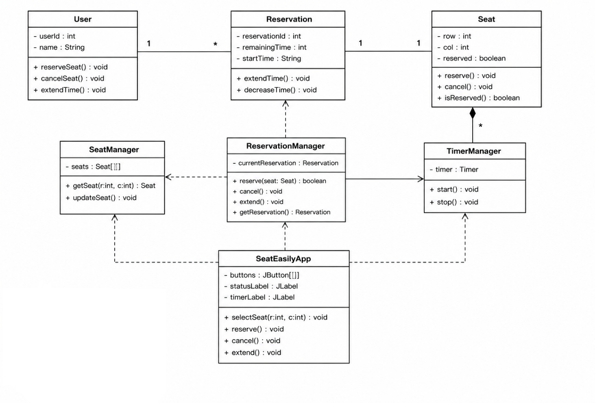
**1) User**

\(1\) Attributes

-userId:int : 사용자 고유 번호

-name:String : 사용자 이름

\(2\) Methods

-reserveSeat():void : 좌석 예약

-cancelSeat():void : 좌석 예약 취소

-extendTime():void : 예약 시간 연장

**2) Seat**

\(1\) Attributes

-row:int : 좌석 행 번호

-col:int : 좌석 열 번호

-reserved:boolean : 예약 여부

\(2\) Methods

-reserve():void : 좌석 예약 상태 변경

-cancel():void : 좌석 예약 취소

-isReserved():boolean : 예약 여부 반환

**3) Reservation**

\(1\) Attributes

-reservationId:int : 예약 번호

-remainingTime:int : 남은 이용 시간

-startTime:String : 예약 시작 시간

\(2\) Methods

-extendTime():void : 예약 시간 연장

-decreaseTime():void : 남은 시간 감소

**4) SeatManager**

\(1\) Attributes

-seats:Seat\[\]\[\] : 전체 좌석 배열

\(2\) Methods

-getSeat(r:int, c:int): 특정 좌석 반환

-updateSeat():void : 좌석 상태 업데이트

**5) ReservationManager**

\(1\) Attributes

-currentReservation:Reservation : 현재 예약 정보

\(2\) Methods

-reserve(seat:Seat):boolean : 좌석 예약 수행

-cancel():void : 예약 취소

-extend():void : 예약 시간 연장

-getReservation():Reservation : 현재 예약 반환

**6) TimerManager**

\(1\) Attributes

-timer:Timer : 시간 카운트 타이머

\(2\) Methods

-start():void : 타이머 시작

-stop():void : 타이머 종료

**7) SeatEasilyApp**

\(1\) Attributes

-buttons:JButton\[\]\[\] : 좌석 버튼 배열

-statusLabel:JLabel : 상태 표시 라벨

-timerLabel:JLabel : 남은 시간 표시 라벨

\(2\) Methods

-selectSeat():void : 좌석 선택

-reserve():void : 좌석 예약

-cancel():void : 예약 취소

-extend():void : 시간 연장

3\. Sequence diagram

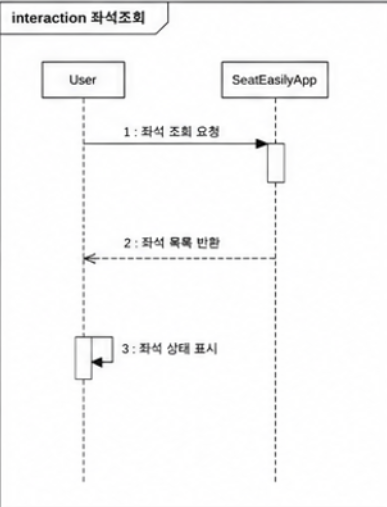

사용자가 좌석 조회를 요청하면 SeatEasilyApp은 SeatManager에게 현재 좌석
상태를 요청한다. SeatManager는 전체 좌석 정보를 확인한 후
SeatEasilyApp에 반환한다. SeatEasilyApp은 반환된 정보를 바탕으로 사용
가능한 좌석과 예약된 좌석을 화면에 표시한다. 이 과정에서 사용자는 현재
예약 가능한 좌석을 확인할 수 있으며, 좌석 상태에 따라 색상으로 구분된
화면을 제공받는다.

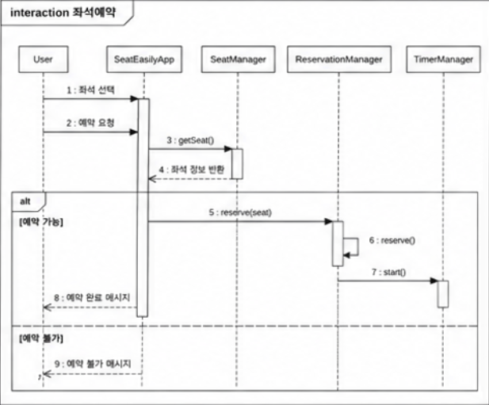

사용자가 좌석을 선택한 후 예약 버튼을 누르면 SeatEasilyApp은
SeatManager를 통해 해당 좌석의 상태를 확인한다. 예약 가능한 좌석인 경우
ReservationManager가 예약 정보를 생성하고 좌석 상태를 예약 중으로
변경한다. 이후 TimerManager가 예약 시간 카운트를 시작한다. 예약이
정상적으로 완료되면 사용자에게 예약 완료 메시지가 표시되며, 이미 예약된
좌석인 경우 예약 불가 안내 메시지가 출력된다.

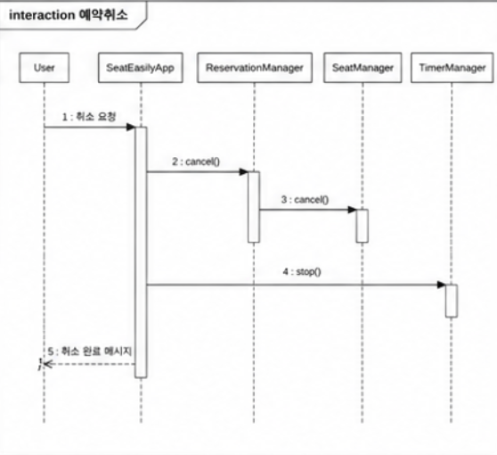

사용자가 예약 취소 버튼을 선택하면 SeatEasilyApp은 ReservationManager에
취소 요청을 전달한다. ReservationManager는 현재 예약 정보를 삭제하고
해당 좌석을 사용 가능한 상태로 변경한다. 이후 TimerManager는 동작 중인
타이머를 중지한다. 모든 작업이 완료되면 SeatEasilyApp은 사용자에게 예약
취소 완료 메시지를 표시한다.

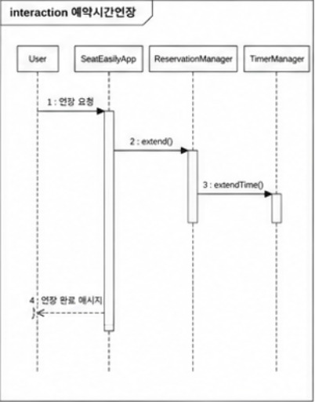
사용자가 예약 시간 연장 버튼을 누르면 SeatEasilyApp은
ReservationManager에 연장 요청을 보낸다. ReservationManager는 현재 예약
정보를 확인한 후 남은 시간을 증가시킨다. 연장이 완료되면 변경된 예약
정보가 저장되고, SeatEasilyApp은 사용자에게 갱신된 남은 시간을 표시한다.

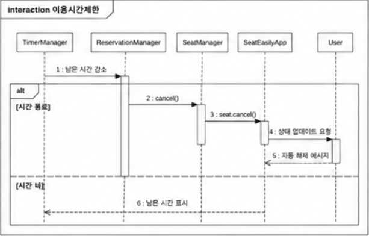{width="5.10877624671916in"
height="3.266949912510936in"}

사용자가 예약 시간을 연장하려고 할 때 시스템은 최대 이용 가능 시간을
확인한다. 설정된 제한 시간을 초과하는 경우 ReservationManager는 연장
요청을 거부한다. SeatEasilyApp은 사용자에게 이용시간 제한 안내 메시지를
표시하며, 제한 범위 내인 경우에만 연장이 허용된다. 이를 통해 특정
사용자가 좌석을 과도하게 점유하는 것을 방지한다.

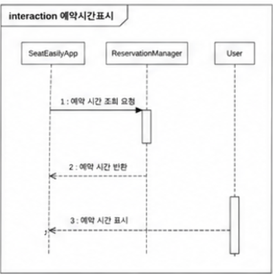

예약이 완료되면 ReservationManager는 예약 시작 시간과 종료 시간을
계산하여 SeatEasilyApp에 전달한다. SeatEasilyApp은 해당 정보를 화면에
출력한다. 사용자는 현재 예약한 시간과 종료 예정 시간을 확인할 수 있으며,
예약 정보는 예약 상태가 유지되는 동안 지속적으로 표시된다.

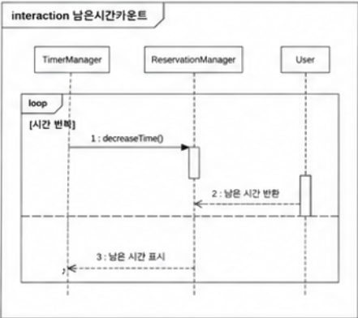

예약이 시작되면 TimerManager가 타이머를 실행한다. 타이머는 일정 주기마다
ReservationManager에 남은 시간을 갱신하도록 요청한다. 갱신된 시간 정보는
SeatEasilyApp에 전달되어 화면에 표시된다. 사용자는 실시간으로 남은 이용
시간을 확인할 수 있다.

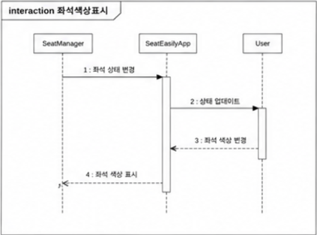

SeatManager는 각 좌석의 상태 정보를 관리한다. SeatEasilyApp이 좌석
정보를 요청하면 SeatManager는 예약 여부를 반환한다. SeatEasilyApp은 사용
가능한 좌석은 초록색, 예약된 좌석은 빨간색으로 표시한다. 이를 통해
사용자는 좌석의 현재 상태를 직관적으로 확인할 수 있다.

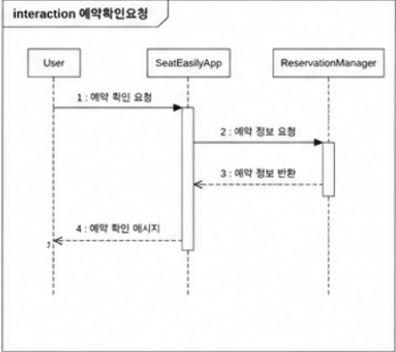

사용자가 좌석 예약 버튼을 누르면 SeatEasilyApp은 예약 확인 창을
표시한다. 사용자가 예약을 확정하면 ReservationManager에 예약 요청이
전달된다. 사용자가 취소를 선택하면 예약 과정은 종료되며 어떠한 예약
정보도 생성되지 않는다. 이를 통해 사용자의 실수로 인한 예약을 방지할 수
있다.

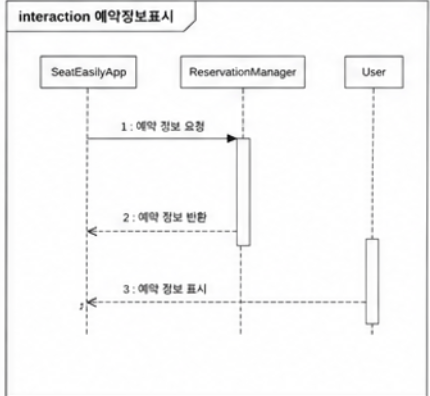

예약이 완료되면 ReservationManager는 현재 예약 정보를 SeatEasilyApp에
전달한다. SeatEasilyApp은 좌석 번호, 예약 시작 시간, 남은 시간 등의
정보를 화면에 출력한다. 사용자는 현재 자신이 예약한 좌석의 상태와 이용
시간을 쉽게 확인할 수 있다.

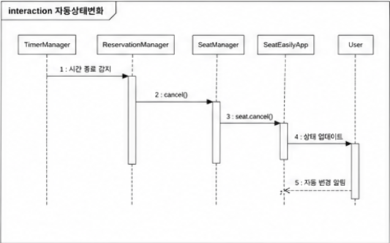

TimerManager는 예약 시간 종료 여부를 지속적으로 확인한다. 남은 시간이
0이 되면 ReservationManager에 예약 종료를 요청한다. ReservationManager는
예약 정보를 삭제하고 좌석 상태를 사용 가능 상태로 변경한다. 이후
SeatEasilyApp은 변경된 좌석 상태를 화면에 반영하여 다른 사용자가 해당
좌석을 예약할 수 있도록 한다.

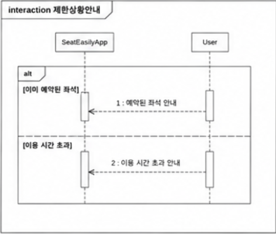

사용자가 이미 예약된 좌석을 선택하거나 이용시간 제한을 초과하는 요청을
수행하면 SeatEasilyApp은 ReservationManager의 처리 결과를 확인한다.
요청이 불가능한 경우 시스템은 사용자에게 오류 또는 제한 안내 메시지를
표시한다. 이를 통해 사용자는 예약 실패 원인을 즉시 확인할 수 있으며
올바른 예약 절차를 진행할 수 있다.

4\. State machine diagram

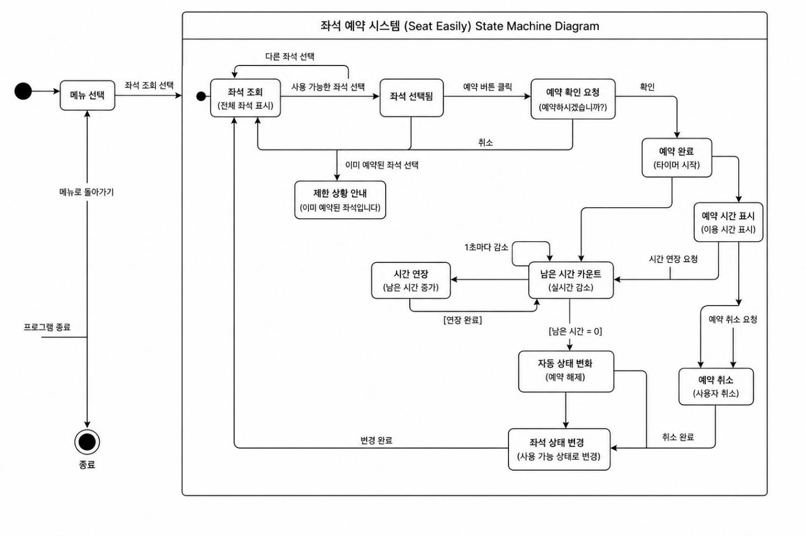

이 기능은 여러 곳에서 사용하는 앱이라 게스트로 사용할 수 있도록 하였다.
게스트로 사용시 좌석을 조회하고 좌석선택, 시간연장, 예약 취소를 할 수
있으며 시스템은 확인요청, 제한상황안내, 남은 시간 카운트, 자동 상태변화,
좌석 상태변경 등을 할 수 있다.

5\. Implementation requirements

-64비트 프로세서와 운영 체제가 필요합니다-

운영 체제: Windows®10 (64-BIT Required)/Windows®11 (64-BIT Required)

프로세서: Intel® Core™ i5-10400 or Intel® Core™ i3-12100 or AMD Ryzen™ 5
3600

메모리: 16 GB RAM

그래픽: NVIDIA® GeForce® GTX 1660(VRAM 6GB) or AMD Radeon™ RX 5500
XT(VRAM 8GB)

DIRECTX: 버전 12

네트워크: 초고속 인터넷 연결

저장 공간: 75 GB 사용 가능 공간

추가 사항: SSD(필수)、그래픽 설정 「매우 낮음」을 통해 1080p(업스케일
사용, 네이티브 해상도 720p)/30fps의 게임 플레이가 가능합니다.
DirectStorage 지원.

구현언어: java

6\. Glossary

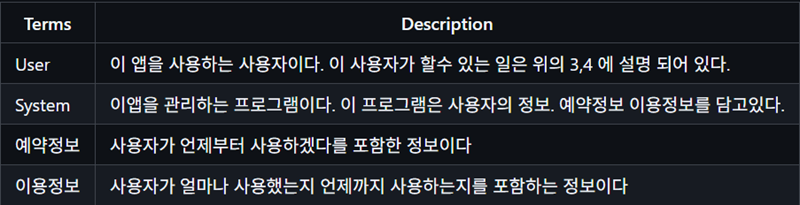

7\. References
